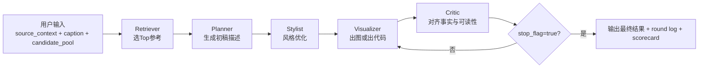
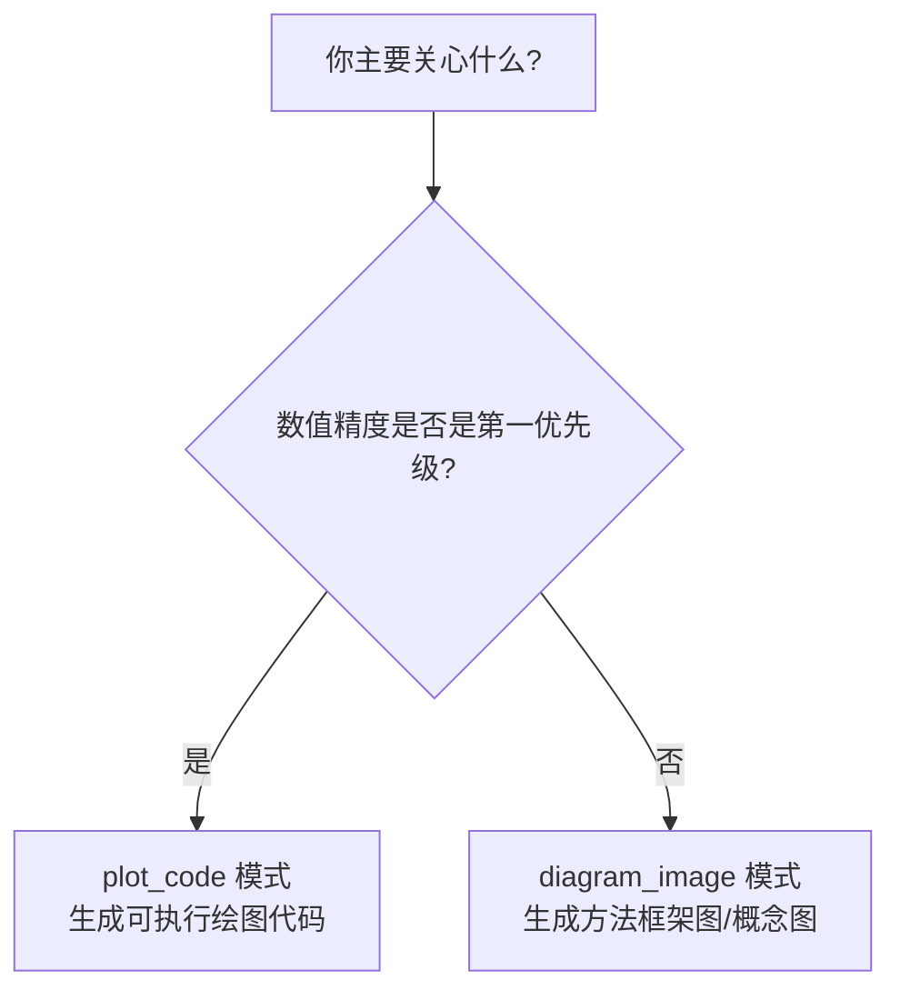
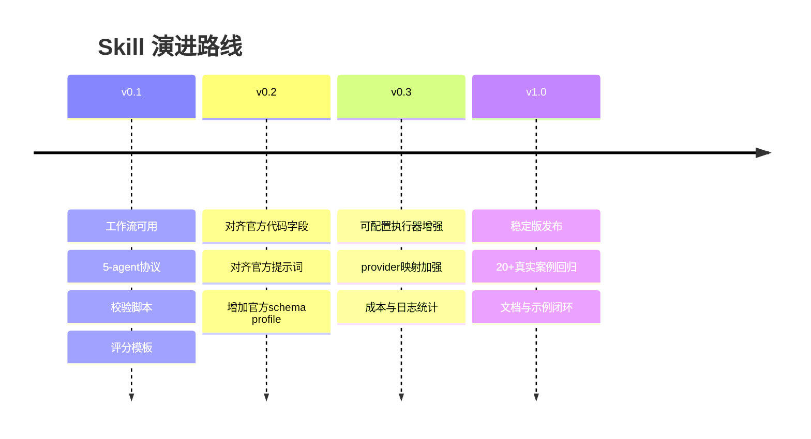

# PaperBanana Agentic Illustration Skill

> 让用户更容易做学术图：把“方法描述 + 图注”转成可迭代、可审查、可交付的图示流程。

这个仓库不是图像模型本体，而是一套**用户友好的做图工作流技能**。  
我们基于 PaperBanana 公开论文思想，做了工程化落地，让你可以稳定跑通：

- 参考检索（Retriever）
- 内容规划（Planner）
- 风格润色（Stylist）
- 图像/代码可视化（Visualizer）
- 迭代批改（Critic）

理论来源：
- [PaperBanana 项目页](https://dwzhu-pku.github.io/PaperBanana/)
- [PaperBanana 论文（arXiv:2601.23265）](https://arxiv.org/abs/2601.23265)

---

## 目录

- [1) 你会得到什么](#1-你会得到什么)
- [2) 一图看懂工作流](#2-一图看懂工作流)
- [3) 三分钟快速上手](#3-三分钟快速上手)
- [4) 完整用户操作手册](#4-完整用户操作手册)
- [5) 输入输出模板](#5-输入输出模板)
- [6) 验收标准](#6-验收标准)
- [7) 常见问题](#7-常见问题)
- [8) 后续改进专区（重点）](#8-后续改进专区重点)
- [9) 当前边界与透明说明](#9-当前边界与透明说明)
- [10) 仓库结构](#10-仓库结构)
- [11) 公开仓库与发布](#11-公开仓库与发布)

---

## 1) 你会得到什么

这个技能帮你把“做图”从一次性 prompt 变成**可复用流程**：

- 更稳定：每一步都有 JSON 契约，不靠“感觉”
- 更可控：默认 T=3 轮迭代，可提前终止
- 更可审查：有 round log、有评分卡、有交付清单
- 更易协作：同一个 case 能被多人复盘

适用对象：
- 研究者：快速把方法段落变成图
- 工程师：把做图流程接入 Agent 系统
- 团队负责人：要求“可追溯、可验收”的交付

---

## 2) 一图看懂工作流


> 上图展示了完整的五代理协作流程：从 Retriever 检索参考 → Planner 规划描述 → Stylist 风格优化 → Visualizer 生成产物 → Critic 迭代审查。支持 `diagram_image` 和 `plot_code` 两种输出模式。

---

### 2.1 端到端流程图



### 2.2 模式选择图



### 2.3 迭代回路图（默认 T=3）


---

## 3) 三分钟快速上手

### Step 1: 准备 demo 输入

在仓库根目录创建：`runs/demo-001/01_input.json`。  
可直接参考 `references/demo-scenario.md` 的示例。

### Step 2: 按顺序执行 5-agent

```text
Retriever -> Planner -> Stylist -> Visualizer -> Critic
```

把每一步输出保存到 `runs/demo-001/`。

### Step 3: 跑校验脚本 + 评分卡

```bash
python3 scripts/validate_agent_io.py \
  --role retriever \
  --input runs/demo-001/01_input.json \
  --output runs/demo-001/02_retriever_output.json

python3 scripts/validate_round_loop.py \
  --log runs/demo-001/05_round_log.json

python3 scripts/build_scorecard_template.py \
  --output-dir runs/demo-001 \
  --case-id demo-001
```

成功后会得到：
- `demo-001-scorecard.json`
- `demo-001-scorecard.md`

---

## 4) 完整用户操作手册

### 4.1 准备输入（最低要求）

- `source_context`
- `communicative_intent`
- `caption`
- `candidate_pool[]`

建议：
- `source_context` 保留关键术语，避免过度改写
- `candidate_pool` 推荐 >= 5 条，检索更稳
- `communicative_intent` 用一句话明确“图要讲什么”

### 4.2 Retriever

目标：选最有帮助的参考样例（1~10 条）

产出：
- `top_refs[]`
- `selection_rationale`
- `retrieval_confidence`

### 4.3 Planner

目标：把方法内容转为结构化图示说明

产出：
- `initial_description`
- `assumption_block`（有歧义时）

### 4.4 Stylist

目标：优化视觉表达，不改语义事实

产出：
- `optimized_description`
- `style_actions[]`

### 4.5 Visualizer

根据模式出产物：
- `diagram_image` -> 图像路径/图像提示
- `plot_code` -> 可执行绘图代码

产出：
- `artifact.type`
- `artifact.value`

### 4.6 Critic + 回路

目标：纠错并推动收敛。

每轮 Critic 产出：
- `critic_suggestions`
- `revised_description`
- `stop_flag`

提前终止必须同时满足：
- `stop_flag=true`
- round log 写 `terminated_early=true`
- round log 写明 `termination_reason`

### 4.7 交付建议

建议最终打包这些文件：
- 输入：`01_input.json`
- 回路：`05_round_log.json`
- 评分：`*-scorecard.json`, `*-scorecard.md`
- 产物：最终图片或代码

---

## 5) 输入输出模板

完整契约见：`references/agent-contracts.md`。

快速示意：

```json
{
  "source_context": "...",
  "communicative_intent": "...",
  "caption": "...",
  "candidate_pool": [{"id": "ref_001", "summary": "..."}]
}
```

建议保持：
- 字段名不改
- 类型不改
- 必填字段不省略

---

## 6) 验收标准

### 基础验收（v0.1）

- [ ] `SKILL.md` 校验通过
- [ ] `agents/openai.yaml` 可解析
- [ ] `validate_agent_io.py` 通过
- [ ] `validate_round_loop.py` 通过
- [ ] 评分卡模板可生成

### 建议增强验收

- [ ] 至少 1 个完整 demo case 跑通
- [ ] 至少 1 个提前终止 case
- [ ] 至少 1 个失败回滚记录

---

## 7) 常见问题

### Q1: 为什么必须有 Critic？
因为“看起来好”不等于“事实对”。Critic 是事实对齐保险丝。

### Q2: 为什么强调 JSON，而不是自由文本？
因为 JSON 才能自动验证、可复盘、可协作。

### Q3: 如果图像生成不稳定怎么办？
优先按顺序优化：
1. Planner 描述更细
2. Stylist 约束更强
3. Critic 给出更可执行建议
4. 切换到 `plot_code`

### Q4: 如果宿主不识别 `openai.yaml`？
不影响主流程。`SKILL.md` 是核心行为规范。

---

## 8) 后续改进专区（重点）

> 这是给用户看的“升级承诺区”。你能清楚知道下一版会怎么变好。

### 8.1 为什么现在就可用

虽然 PaperBanana 官方代码尚未完整开源，但我们已经把最关键的工程要素固化：
- 角色分工
- 数据契约
- 迭代回路
- 质量评分

这保证你今天就能用，且不是一次性 prompt hack。

### 8.2 未来升级路线（用户视角）



### 8.3 我们会优先改进什么

1. 与官方实现一致性
2. 真实案例模板数量
3. 更友好的错误提示
4. 更轻量的上手体验

### 8.4 你可以如何参与

欢迎反馈：
- 失败 case（最好附 `05_round_log.json`）
- 你希望新增的图示模板
- 你希望支持的模型映射

这些反馈会直接进入下一版优先级。

---

## 9) 当前边界与透明说明

当前版本不包含：
- 私有 API key 管理
- 内置图像引擎调用器
- 对“未开源官方实现”做一比一复刻承诺

当前定位：
- **可用、可查、可升级的 workflow skill 层**

---

## 10) 仓库结构

```text
paperbanana-agentic-illustration/
├── SKILL.md
├── README.md
├── agents/
│   └── openai.yaml
├── references/
│   ├── paperbanana-theory-mapping.md
│   ├── agent-contracts.md
│   ├── prompt-templates-zh-en.md
│   ├── model-adapter-map.md
│   ├── install-and-compat.md
│   └── demo-scenario.md
└── scripts/
    ├── validate_agent_io.py
    ├── validate_round_loop.py
    └── build_scorecard_template.py
```

---

