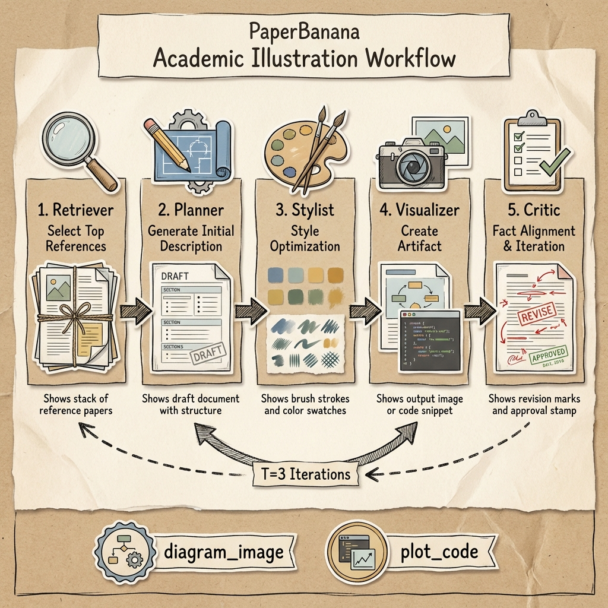
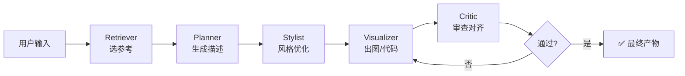
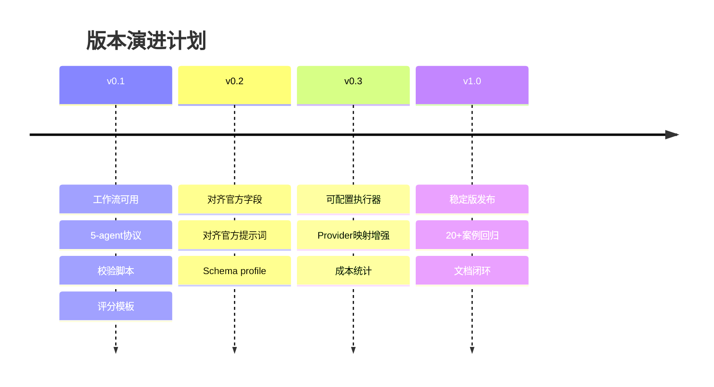

# PaperBanana Agentic Illustration

> 🎨 **把学术论文的方法描述变成专业图示** — 基于多代理协作的可迭代、可验证学术图像生成工作流。



---

## ✨ 特性亮点

| 特性 | 说明 |
|------|------|
| 🔄 **五代理协作** | Retriever → Planner → Stylist → Visualizer → Critic 完整流程 |
| 🎯 **双模式输出** | `diagram_image` 概念图 / `plot_code` 数据图 自由切换 |
| 🔁 **智能迭代** | 默认 3 轮 Critic 审查，自动收敛或提前终止 |
| 📋 **契约驱动** | JSON 格式输入输出，可验证、可复盘 |
| 📊 **质量评估** | 内置评分卡：Faithfulness / Conciseness / Readability / Aesthetics |

---

## 🚀 快速开始

### 1️⃣ 准备输入

在 `runs/demo-001/` 创建输入文件 `01_input.json`：

```json
{
  "source_context": "你的方法描述文本...",
  "communicative_intent": "这张图要传达什么",
  "caption": "Figure 1: 方法框架图",
  "candidate_pool": [
    {"id": "ref_001", "summary": "参考图示描述"},
    {"id": "ref_002", "summary": "另一个参考"}
  ]
}
```

> 💡 完整示例见 [`references/demo-scenario.md`](references/demo-scenario.md)

### 2️⃣ 执行五代理流程

按顺序调用五个代理角色：

```
Retriever → Planner → Stylist → Visualizer → Critic
```

每个代理的输出保存到 `runs/demo-001/` 目录。

### 3️⃣ 验证与评分

```bash
# 验证代理输出格式
python3 scripts/validate_agent_io.py \
  --role retriever \
  --input runs/demo-001/01_input.json \
  --output runs/demo-001/02_retriever_output.json

# 验证迭代回路
python3 scripts/validate_round_loop.py \
  --log runs/demo-001/05_round_log.json

# 生成评分卡
python3 scripts/build_scorecard_template.py \
  --output-dir runs/demo-001 \
  --case-id demo-001
```

---

## 📖 工作流详解

### 流程概览



### 模式选择

| 模式 | 适用场景 | 输出类型 |
|------|----------|----------|
| `diagram_image` | 方法框架图、概念图、流程图 | 图像提示/图片 |
| `plot_code` | 数据图表、统计可视化 | 可执行代码 |

**选择建议**：数值精度优先 → `plot_code`；视觉叙事优先 → `diagram_image`

### 五代理职责

| 代理 | 职责 | 输出 |
|------|------|------|
| **Retriever** | 从候选池选择最相关参考 | `top_refs[]`, `retrieval_confidence` |
| **Planner** | 将方法文本转为结构化图示描述 | `initial_description` |
| **Stylist** | 优化视觉表达（不改语义） | `optimized_description`, `style_actions[]` |
| **Visualizer** | 生成图像或绘图代码 | `artifact.type`, `artifact.value` |
| **Critic** | 事实对齐检查，推动迭代收敛 | `critic_suggestions`, `stop_flag` |

### 迭代机制

- **默认轮数**: T=3
- **提前终止**: 当 `stop_flag=true` 且无重大事实错误时
- **回滚保护**: 每轮保留 `round_log` 便于追溯

---

## ❓ 常见问题

<details>
<summary><b>为什么必须有 Critic？</b></summary>

"看起来好" ≠ "事实对"。Critic 是事实对齐的保险丝，确保生成的图示忠实于原始方法描述。
</details>

<details>
<summary><b>图像生成不稳定怎么办？</b></summary>

按顺序尝试：
1. 让 Planner 描述更详细
2. 让 Stylist 约束更明确
3. 让 Critic 给出更具体建议
4. 切换到 `plot_code` 模式
</details>

<details>
<summary><b>为什么用 JSON 而不是自由文本？</b></summary>

JSON 契约让整个流程可验证、可复盘、可协作。自由文本难以自动检查正确性。
</details>

---

## 📚 参考资料

- 🔗 [PaperBanana 项目主页](https://dwzhu-pku.github.io/PaperBanana/)
- 📄 [PaperBanana 论文 (arXiv:2601.23265)](https://arxiv.org/abs/2601.23265)

**本仓库文档**:
- [`references/agent-contracts.md`](references/agent-contracts.md) — 代理输入输出契约
- [`references/prompt-templates-zh-en.md`](references/prompt-templates-zh-en.md) — 中英文提示词模板
- [`references/demo-scenario.md`](references/demo-scenario.md) — 完整示例场景

---

## 📁 仓库结构

```
paperbanana-agentic-illustration/
├── SKILL.md                 # 核心行为规范
├── README.md                # 本文档
├── assets/                  # 图片资源
├── agents/
│   └── openai.yaml          # OpenAI 代理配置
├── references/              # 参考文档
│   ├── agent-contracts.md
│   ├── prompt-templates-zh-en.md
│   ├── demo-scenario.md
│   └── ...
└── scripts/                 # 校验脚本
    ├── validate_agent_io.py
    ├── validate_round_loop.py
    └── build_scorecard_template.py
```

---

## 🛠️ 开发者专区

> 以下内容面向开发者和贡献者，普通用户可跳过。

### 当前版本状态 (v0.1)

**已实现**:
- ✅ 五代理协议定义
- ✅ JSON 契约校验脚本
- ✅ 迭代回路验证
- ✅ 评分卡模板生成

**暂不包含**:
- ❌ 内置图像引擎调用器
- ❌ API Key 管理
- ❌ 官方实现一比一复刻

### 演进路线



### 验收清单

```
[ ] SKILL.md 校验通过
[ ] agents/openai.yaml 可解析
[ ] validate_agent_io.py 全部通过
[ ] validate_round_loop.py 通过
[ ] 评分卡模板可生成
[ ] 至少 1 个完整 demo case
[ ] 至少 1 个提前终止 case
```

### 如何参与

欢迎提交：
- 🐛 失败 case（附 `round_log.json`）
- 💡 新图示模板建议
- 🔌 新模型 Provider 映射

---

<p align="center">
  <sub>基于 <a href="https://arxiv.org/abs/2601.23265">PaperBanana</a> 论文思想的工程化实现</sub>
</p>
